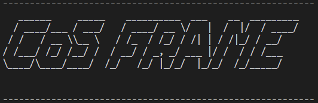

<p align=center>  </p>

<h1 align="center"> CoS </h1>

<p align="center">Learning Hierarchical Time Series Data Augmentation Invariances via Contrastive Supervision for Human Activity Recognition </p>

[Dongzhou Cheng](https://github.com/cheng-haha)

## Abstract
TODO. We hope this research can bring a new perspective to the HAR community.
## Getting Started
1. Git clone the repo
```
git clone https://github.com/cheng-haha/CoS.git
```
2. Requirements
```
pip install -r requirements.txt
```
3. Extract the file to get the following directory tree
```
.
├── common.py
├── configs.py
├── dataset
│   ├── HAR_dataset.py
│   └── ucihar
├── Figure
│   ├── frame.png
│   └── inference_time.png
├── loss
│   └── SupCon.py
├── main.py
├── models
│   ├── Baseline_CNN.py
│   ├── CoS_CNN.py
│   └── __init__.py
├── README.md
├── requirements.txt
├── save
│   └── ucihar
├── scripts
│   └── run.sh
└── utils
    ├── augmentations.py
    ├── logger.py
    ├── metric.py
    ├── setup.py
    └── train.py

9 directories, 18 files
```
Get required dataset from [UCI Machine Learning Repository](http://archive.ics.uci.edu/ml/index.php), do data pre-processing by sliding window strategy and split the data into different sets. Other datasets are too large, please contact us by e-mail <chengdongzhou666@qq.com> if you need one of these.
## Run
NOTE: Check in the `config.py` file that your path `dataset_path` is correct. Then you can do
```
bash scripts/run.sh
```
## Citation
```
TODO
```
