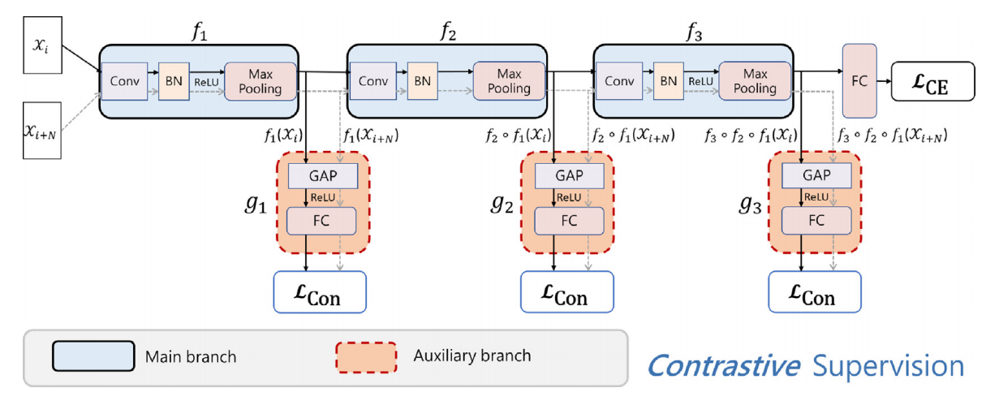

<p align=center>  </p>


<p align="center"><em>Learning Hierarchical Time Series Data Augmentation Invariances via Contrastive Supervision for Human Activity Recognition (KBS 2023)</em></p>

<p align="center"><a href="https://scholar.google.com.sg/citations?user=zOg9ENIAAAAJ&hl=zh-CN&oi=sra">Dongzhou Cheng</a></p>



## A simple, efficient, and effective method
Our proposed method, CoS (**Co**ntrastive **S**upervision), enhances the feature quality of each layer and improves the generalization performance of the model, **without introducing any additional computational burden**. By leveraging temporal data augmentation and contrastive loss, CoS effectively strengthens the discriminative power of the learned features at every layer, leading to a more generalized representation. This approach exhibits remarkable scalability and **can be seamlessly integrated into various Human Activity Recognition (HAR) models**, making it applicable across a wide range of HAR tasks. With CoS, we not only achieve enhanced performance but also establish a solid foundation for future advancements in HAR research.

## Citation
```
@article{cheng2023learning,
  title={Learning hierarchical time series data augmentation invariances via contrastive supervision for human activity recognition},
  author={Cheng, Dongzhou and Zhang, Lei and Bu, Can and Wu, Hao and Song, Aiguo},
  journal={Knowledge-Based Systems},
  pages={110789},
  year={2023},
  publisher={Elsevier}
}
```

## Getting Started
1. Git clone the repo
```
git clone https://github.com/cheng-haha/CoS.git
```
2. Requirements
```
pip install -r requirements.txt
```
3. Extract the file to get the following directory tree
```
.
├── common.py
├── configs.py
├── dataset
│   ├── HAR_dataset.py
│   └── ucihar
├── Figure
│   ├── frame.png
│   └── inference_time.png
├── loss
│   └── SupCon.py
├── main.py
├── models
│   ├── Baseline_CNN.py
│   ├── complex
│   ├── CoS_CNN.py
│   └── __init__.py
├── README.md
├── requirements.txt
├── save
│   └── ucihar
├── scripts
│   └── run.sh
├── tree.txt
└── utils
    ├── augmentations.py
    ├── logger.py
    ├── metric.py
    ├── setup.py
    └── train.py

10 directories, 19 files
```
Get required dataset from [UCI Machine Learning Repository](http://archive.ics.uci.edu/ml/index.php), do data pre-processing by sliding window strategy and split the data into different sets. Other datasets are too large, please contact us by e-mail <chengdongzhou666@qq.com> if you need one of these.
## Run
NOTE: Check in the `config.py` file that your path `dataset_path` is correct. Then you can do
```
bash scripts/run.sh
```

